# Mermaid Icon Test

This diagram tests the generic `icon:` prefix (which maps to the Lucide icon pack):

```mermaid
architecture-beta
    group api(icon:cloud)[API]
    service db(icon:database)[Database] in api
    service disk(icon:hard-drive)[Storage] in api
    db:L -- R:disk
```

Check if icons appear correctly.

# Tag Test
This is a ::: tag "v0.7.4" color:#f0f inline tag.
And this is a ::: tag "With Icon" icon:star color:blue link:https://google.com inline tag.
